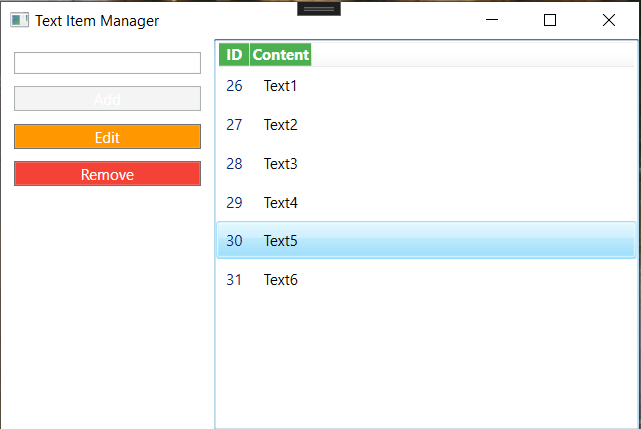

# Text Item Manager

TextItemManager is an application designed for managing and organizing text items. It follows the MVVM architecture and utilizes Entity Framework Core to connect to a PostgreSQL database.

## Table of Contents

- [Project Overview](#project-overview)
- [Project Structure](#project-structure)
- [Features](#features)
- [Prerequisites](#prerequisites)
- [Installation](#installation)
- [Configuration](#configuration)
- [Running Migrations](#running-migrations)
- [Usage](#usage)

## Project Overview

This project serves as a foundation for building a text item management system. It is structured following the MVVM pattern, facilitating separation of concerns and maintainability. The integration with Entity Framework Core allows seamless communication with a PostgreSQL database.

## Project Structure

The project is organized into several key folders:

- **TextItemManager**: Main project folder.
  - **Data**: Contains database-related components.
    - `DataContext.cs`: Defines the DbContext for the Entity Framework Core.
  - **Models**: Holds the data models.
    - `TextItem.cs`: Represents the structure of a text item.
  - **ViewModels**: Implements the ViewModel classes adhering to MVVM.
    - `MainViewModel.cs`: Manages the logic for the main application screen.
    - `ViewModelBase.cs`: Serves as the base class for ViewModels in an application, providing common functionalities and properties.
 - **Views**: Defines the visual representation of the application.
	- `MainWindow.xaml`: Defines the structure of the main window.
	- `MainWindow.xaml.cs`: Implements the code-behind for the main window.
 - **RelayCommand.cs**: A utility class for simplifying ICommand implementations.
 - **App.xaml.cs**: Configures the application on startup.


## Features

- **Add, Edit, and Remove Text Items**: Easily manage text items with intuitive user interactions.
- **Asynchronous Operations**: Supports asynchronous execution for database operations, preventing UI freezing.
- **Command Pattern**: Utilizes the RelayCommand class to simplify the implementation of ICommand instances.

## Prerequisites

Before you begin, ensure you have the following installed:

- [.NET Core SDK](https://dotnet.microsoft.com/download)
- [PostgreSQL](https://www.postgresql.org/download/)

## Installation

1. Clone the repository.
2. Open the solution in your preferred development environment.
3. Build the solution to restore dependencies.

### Required NuGet Packages

Install the following NuGet packages using the Package Manager Console:

```bash
Install-Package Microsoft.EntityFrameworkCore
Install-Package Npgsql.EntityFrameworkCore.PostgreSQL
Install-Package Microsoft.EntityFrameworkCore.Tools
```

## Configuration

1. Ensure you have a PostgreSQL database set up.
2. Update the connection string in DataContext.cs with your PostgreSQL database details.

```charp
optionsBuilder.UseNpgsql("Host=localhost;Database=<your_database>;Username=<your_username>;Password=<your_password>");
```

## Running Migrations
To apply the database schema, run the following commands in the Package Manager Console:
```bash
Add-Migration InitialCreate
Update-Database
```
## Usage
1. Launch the application.
2. Interact with the main screen to add, edit, or remove text items.

## Screenshots

- Home page.If you do not click anywhere, all buttons are inactive. </br>

- When the text field is filled, the Add button becomes active. </br>

- When you click on one of the contents, the Edit and Remove buttons become active. </br>

- When the Edit button is pressed, a new pop up opens. </br>

- If the Edit Content is empty, the Save button will be inactive. In this way, empty content is prevented from being recorded. </br>


